<h1 align="center">Hi there 👋</h1>

  <picture>
    <source media="(prefers-color-scheme: dark)" srcset="./dark_mode.svg" />
    <source media="(prefers-color-scheme: light)" srcset="./light_mode.svg" />
    
  </picture>

<!--
  The terminal above is auto-generated by today.py and refreshed by
  .github/workflows/main.yml. See SETUP.md to wire it up to your account.
-->
